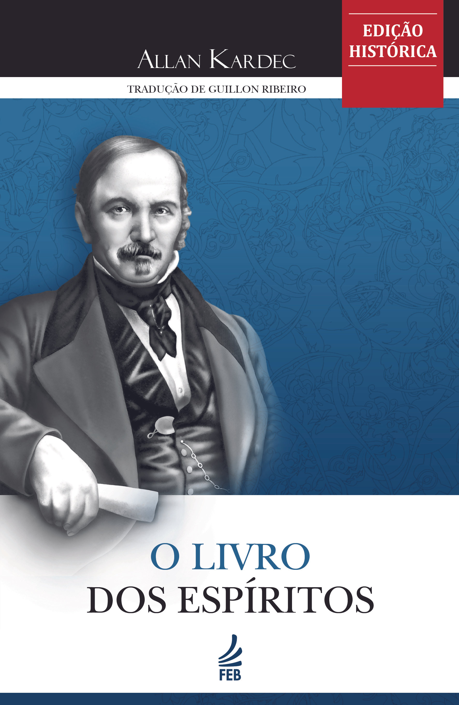

# Um dos cinco repositórios de Doutrina.org

| Direto ao ponto                                              |
| ------------------------------------------------------------ |
| O Livro dos Espíritos (ISBN 978-85-7328-728-8)[^1] digitalizado (manualmente, de parágrafo em parágrafo) em duas opções: |
| um único arquivo                                             |
| ~~separado em 253 partes~~ (*defasadas em virtude de mudanças recentes no arquivo único, que é a fonte das partes*) |

---

## Apresentação

Temos o intuito de maximizar a disseminação, pesquisa, interligação, e estudo da Doutrina Espírita, codificada materialmente por Allan Kardec com a direção do Espírito da Verdade. 

Para isso, escolhemos usar a coletânea de Guillon Ribeiro & Manuel Quintão como base, por ser uma das mais encontradas, tanto em formato físico como no digital.  O objetivo seria de criar um arquivo que não sofresse da rigidez do PDF (páginas de tamanho fixo), fosse de mais fácil edição que um ePUB, e não usasse DRM (como AZW do Kindle). Formatos proprietários como DOC ou DOCX foram rejeitados. Formatos livre e simples como TXT ou RTF não são capazes de usar imagens ou tabelas. Formatos como ODF não conseguem suportar arquivos de tamanho comprimento com eficiência. 

Decidi então por adotar o formato MarkDown (.md) pela sua fácil edição. Adicionalmente, o formato permite que o mesmo sirva de fonte para conversões em arquivos diversos, tal como HTML/CSS (em SSG), JSON, etc. Isto ainda facilita a utilização por programadores que queiram usar o mesmo para servir de base ou banco de dados para seus próprios projetos, tais como *apps*.

##  Análise

Em primeiro lugar, teríamos que estabelecer padrões de formatação que mantivesse a fidelidade ao original, não em forma, mas em conteúdo.

Analisando a particionamento do livro em partes, decidi nomear a seção anterior à Parte 1 como Parte 0, e dar o título de Pré-textual. 

A formatação original da Editora, na  qual perguntas se encontravam em itálico e repostas em fonte normal forçou que trechos em realce se fizessem na fonte oposta, como no exemplo abaixo:

---

| Formatação original do livro impresso |
| ------------------------------------- |

X. *Pergunta lorem ipsum dolor sit* amet, consectetur adipiscing elit?

Resposta sed do eiusmod *tempor* incididunt ut labore et dolore magna aliqua.

Comentário de Kardec Duis aute irure dolor in reprehenderit in voluptate.

---

Obs. Na Pergunta, palavra 'amet' foi realçada em fonte normal, visto que a sentença se encontra em itálico. Na Resposta, palavra 'tempor' foi realçada em itálico, visto que a sentença se encontra em fonte normal.

Outra forma originalmente utilizada para diferenciar os comentários de Kardec das mensagens de Espíritos, foi o de usar uma fonte ligeiramente menor em tamanho. Considero estas escolhas de formatações demasiada sutis (não chamam a atenção do leitor com eficiência), além de introduzir confusão na padronização. Adicionalmente, as mesmas não são apropriada para o formato *Markdown*, ou a análise e formatação automática por meio de *scripts*, sendo o método que nosso maior colaborador, <a href="https://github.com/JhonnyBn">JhonnyBn</a>, criou para automatizar o processo.

## Solução

Sendo assim, decidi formatar todo o texto em fonte normal com as seguintes exceções: Os trechos originalmente em *itálico* foram mudados para **negrito**. Trechos entre aspas (mensagens espirituais) viraram *blockquote*. Comentários de Kardec viraram *nested blockquotes* como no exemplo abaixo.

---

| Formatação de Doutrina.org |
| -------------------------- |

 X. Pergunta lorem ipsum dolor sit **amet**, consectetur adipiscing elit? 

 > Resposta sed do eiusmod **tempor** incididunt ut labore et dolore magna aliqua.
 >
 > > Comentário de Kardec Duis aute irure dolor in reprehenderit in voluptate.

---

Acredito que o formato acima utiliza com muita mais eficiência o realce de certos trechos. Ademais, comentário de Kardec são visualmente ligados à resposta à que se referem.

Para facilitar a organização hierárquica, localização, correlação de items, e brevidade, um código mestre foi criado. Para isso, pequenas mudanças foram feitas -- em forma, não em conteúdo. Este código alfanúmerico é demonstrado abaixo.

### Estrutura de hieraquia

<pre>
📔 Livro
 |
 └── 🗂️ Parte
     |
     └── 📑 Capítulo
         |
         └── 📄 Item
</pre>

### Código alfanúmerico

<pre>
📄 lde.0.00.00
    │  │  │  │
    │  |  |  └── 📄 Item
    |  |  |
    │  |  └── 📑 Capítulo
    |  |
    │  └── 🗂️ Parte
    |
    └── 📔 Livro
</pre>

Como ilustrado acima, usamos três letras para o livro, e de um a dois dígitos para partes, capítulos, e itens. Em especial, no LDE, usamos a letra `q`, de um a quatro dígitos, e uma letra minúscula para sub-itens de modo a designar uma pergunta específica (ex. `lde.q909a`).

Em sequência, converteremos os outros livros da codificação. Ao término de GEN, iremos criar um *fork* para incluir *inline links* (dicionário, Wikipédia, videos, etc), figuras, citações biblícas, e outros aperfeiçoamentos.

Clique abaixo para abrir o livro em arquivo único.

- [LDE](./lde-single-file.md)

[^1]: Copyright 1944 by FEB. Uma ofensa aos direitos autorais não se constitui desde que se limite o uso de acordo com o [Artigo 46, Capítulo IV, Lei Nº 9.610, de 19 de Fevereiro de 1998](http://www.planalto.gov.br/ccivil_03/leis/l9610.htm#:~:text=Art.%2046.%20N%C3%A3o%20constitui%20ofensa%20aos%20direitos%20autorais%3A).
